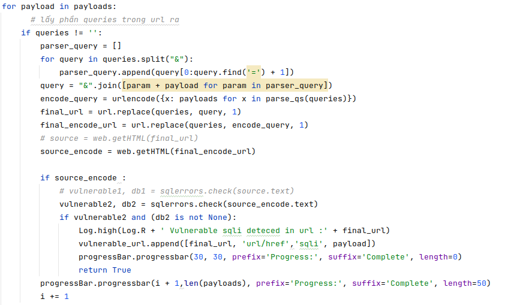
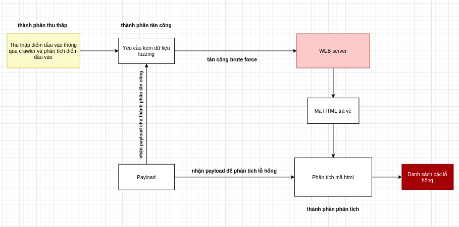
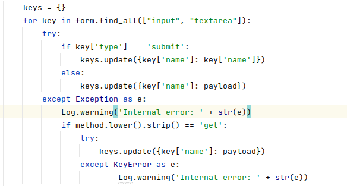
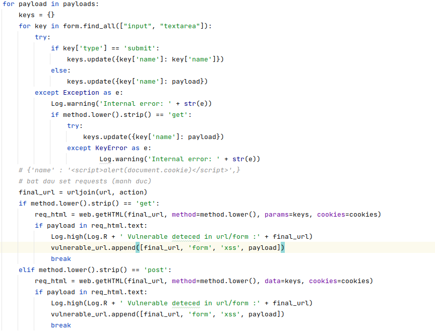
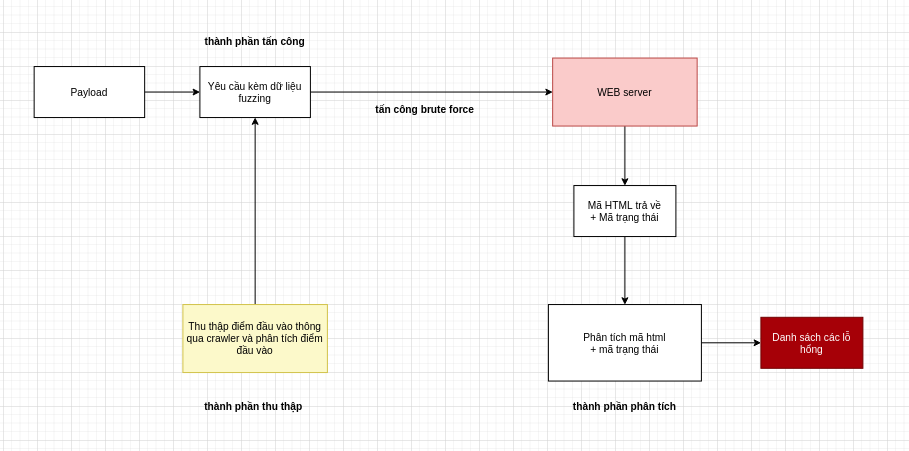
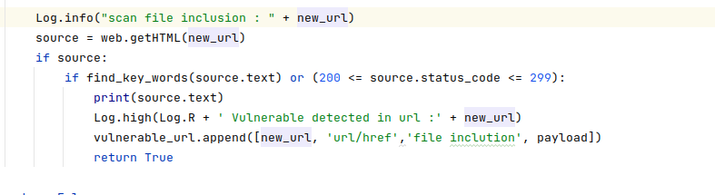

# ỨNG DỤNG FUZZING TRONG KIỂM THỬ WEB
## _được thực hiện bởi LittleHawk03 nhóm 4_

[](https://www.youtube.com/watch?v=dQw4w9WgXcQ)

[](https://travis-ci.org/joemccann/dillinger)

Dillinger is a cloud-enabled, mobile-ready, offline-storage compatible,
AngularJS-powered HTML5 Markdown editor.

- Type some Markdown on the left
- See HTML in the right
- ✨Magic ✨

## Features

- kiểm thử lỗi sql injection thông qua phương pháp error base
- kiểm thử lỗi Cross-site Scripting (XSS) 
- kiển thử lỗi File Inclusion
- Crawler url từ một web site theo cấp độ 


## Tech requirement

những yêu cầu cấu hình :

- [Python] - yêu cầu từ phiên bản python 3.x
- [Pip] - yêu cầu trình quản lý gói pip
- [git] - có thể có hoặc không để clone dư án về

## Installation

requires [python](https://www.python.org/downloads/) v10+ to run.

clone data from github : 

```sh
git clone https://github.com/LittleHawk03/Fuzzing_Project.git
```

Install the dependencies and devDependencies and start to run.

```sh
pip install -r requirement.txt
```

## How to runs

Để chạy tool scan vào thư mục project chứa file fuzzing.py chạy lệnh sau.

```sh
python fuzzing.py [-h] [-u TARGET] [-c] [-s] [-x] [-f] [-a] [-ps] [-px]
```

| Plag | option | funtion |
| ------ | ---- | ----------- |
|-h| --help |show this help message and exit|
| -u | --url  |  target url for scanning |
|-c | --crawler |the option for auto crawler from a url|
|-s| --sql     |auto detect a sql injection from a url|
|-x| --xss|   auto detect a sxx vulnerable from a url|
|-f| --file|  auto detect a file inclusion from a url|
|-a| --auto|  auto crawler and scanner all url after crawler url form a website|
|-ps| --payloadsqli|    show all payload of sql injection|
|-px| --payloadxss|     show all payload of xss vulnerable|
  
# Chức năng 1 : Cào (Crawler) URL từ một website mục tiêu.

#### lệnh chạy chứ năng crawler:

```sh
python fuzzing.py -u [TARGET URL] -c
```

#### example :

```sh
python fuzzing.py -u http://testphp.vulnweb.com/categories.php -c
```


### Logic và sound code [crawler](https://github.com/LittleHawk03/Fuzzing_Project/blob/main/WebConfig/crawler.py): 


### Code và thực nghiệm :


- **_mục tiêu :_** lấy đươc các url có trong các thẻ href của mục tiêu (các url cho trước)
- **_Các bước thực hiện :_**
   - **Bước 1 :** lấy url của mục tiêu, khởi tạo đối tượng Crawler 
  
   - **Bước 2 :** thực hiện quá trình crawler (các url sau khi được phân tích sẽ được lưu vào list visited_link)
    
   
      sử dụng đệ quy để cào sâu (deep_crawler) theo level = 1,2,...
  
   

   - **bước 3 :** thu kết quả
  
   

- **_kết quả :_**
 
  - kết quả được trả về là một list các url thu được trong quá trình cào
    
  - _hạn chế :_ thời gian thực thi trương trình tốn nhiều thời gian 
# Chức năng 2 : Dò quét lỗ hổng SQL INJECTION.

#### lệnh chạy chứ năng san sql ịnection:

```sh
python fuzzing.py -u [TARGET URL] -s 
```

```sh
python fuzzing.py -u [TARGET URL] --sql 
```

#### example :


```sh
python fuzzing.py -u http://testphp.vulnweb.com/categories.php -s
```
```sh
python fuzzing.py -u http://testphp.vulnweb.com/categories.php --sql
```

### Logic và sound code [sql ịnection](https://github.com/LittleHawk03/Fuzzing_Project/tree/main/SQLi):


### code và thực nghiệm :


- **_Mục tiêu :_** tìm và phân tích được lỗ hổng sql injection trong một website bằng cách chén các dữ liệu không hợp lệ vào url hoặc form
- **_Các bước thực hiện :_**

    - **Bước 1:** quá trình sinh payload và lưu vào một list (được lưu ở file [sqli.txt](SQLi/sql.txt))
    
      

    - **Bước 2:** Phân tích url tách lấy phần query để tiến hành thêm payload (để hiểu rõ hơn đọc comment code tại file [scanSqlErrorBase.py](SQLi/scanSqlErrorBase.py))

      

    - **Bước 3:** dùng kỹ thuật tấn công brute-force gửi hàng loạt yêu cầu chứa payload đến máy chủ để lấy mã html về phân tích 
  
      

    - **Bước 4:** Dùng dữ liệu có sẵn nhận dạng lỗ hổng 

      

    - **Bước 5:** Lấy kết quả nếu trong mã html trả về có tồn tại các lỗi được thông báo từ database thì sẽ là có thể có lỗ hổng sql injection
    
      

    - **Bước 6:** kiểm tra các thẻ form trong url đó có bị sql injection không (đọc phần comment trong file [scanSqlErrorBase.py](SQLi/scanSqlErrorBase.py))
        
      

- **_Kết Quả :_** trả về list các url có thể có lỗ hổng sql injection
    
    
- **_Hạn chế :_** không thể đảm quá trình quét là đây đủ trong khi thời gian thực hiện quét khá lâu thương là hơn 100s


# Chức năng 3 : Dò quét lỗ hổng Cross-Site Scripting (XSS).

#### lệnh chạy chứ năng scan Cross-Site Scriptingn:


```sh
python fuzzing.py -u [TARGET URL] -x 
```

```sh
python fuzzing.py -u [TARGET URL] --xss
```

#### example :


```sh
python fuzzing.py -u http://testphp.vulnweb.com/categories.php -x
```
```sh
python fuzzing.py -u http://testphp.vulnweb.com/categories.php --xss
```

### Logic và sound code [xss](https://github.com/LittleHawk03/Fuzzing_Project/tree/main/XSS):




### Code và thực nghiệm


- **_Mục Tiêu :_** nhận dạng các lỗ hổng xss thông qua việc chèn payload thông qua url (ở đây sẽ chủ yếu trên thẻ form)
- **_Các bước thực hiện :_**

    - **Bước 1 :** sinh payload trong file [xss.txt](XSS/xss.txt)
    
      
  
    - **Bước 2 :** sẽ tập trung chủ yếu vào các thẻ form trên mã html nên bước này sẽ là tạo dữ liệu fuzzing (thương là dữ liệu để post có dạng là một dictionary trong python {'name':'Manh Duc','age':'20'})
    
      
  
    - **Bước 3 :** sử dũng kỹ thuật tấn công brute force đẩy gửi liên tục các dữ liệu payload lên máy chủ web để lấy mã html trả về

      
      
        - _sau khi lấy được mã html ta tiến hành phân tích nếu như mà trong mã html có tồn tại payload thì có tồn tại lỗi xss_
    - **Bước 4 :** thu kết quả sau khi quét tại 
  
      
    
    - **Bước 5 :** có thể chèn các payload vào phần query của url (vd:id=payload) rồi vẫn kiểm tra xem payload có trong url không 

- **_Kết quả :_** kết quả trả về là list các url có lỗi xss
- **_Hạn chế :_** không đảm bảo có thể quét hết lỗi và thời gian thư thi lâu > 100s
        
# Chức năng 4 : Dò quét lỗ hổng File Inclusion.

lệnh chạy chứ năng scan File Inclusionn:

```sh
python fuzzing.py -u [TARGET URL] -f 
```

```sh
python fuzzing.py -u [TARGET URL] --file
```

example :

```sh
python fuzzing.py -u http://testphp.vulnweb.com/categories.php -f
```
```sh
python fuzzing.py -u http://testphp.vulnweb.com/categories.php --file
```


### Logic và sound code [file inclusion](https://github.com/LittleHawk03/Fuzzing_Project/tree/main/FileInclusion) :





### Code và thực nghiệm :


- **_Mục Tiêu :_** nhận dạng được các lỗ hổng file inclusion thông qua url
- **_Các bước thực hiện :_**

  - **Bước 1 :** sinh payload tại file [fileic.txt](FileInclusion/fileic.txt)

  - **Bước 2 :** chèn các payload vào url :

     - _C1 : chèn payload vào query trong các url tồn tại query ví dụ: https:// manhduc/name=1+/etc/pass -> https: //manhduc/name=/etc/passwd_

     - _C2 : chèn payload vào url không có phần query ví dụ: https: //manhduc/ + /etc/pass -> https: //manhduc/etc/passwd__

    

  - **Bước 3:** gửi yêu cầu đến máy chủ để nhận mã html và mã trạng thái (có 2 cách để xác định là nhờ vào mã trạng thái trả về nếu mã trạng thái từ 200 -> 299 thì có lỗ hổng hoặc so sánh lỗi với các testcase cho trước)

    


## Giải thích tác dụng của một số module 

### A. Các module trong [WebConfig](WebConfig)

##### 1. [web.py](WebConfig/web.py)

module này sử dụng module request để xây dụng request get và request post và có sử dụng bắt ngoại lệ đây là module quan trong để có thế trả về mã html, mã trạng thái và các thông số cần thiết trong quá trình fuzzing module cho phép chuyền vào các thông tin như cookie, header, data, param, ... 


##### 2. [useragents.py](WebConfig/useragents.py)

module này dùng để sinh ngẫu nhiên user-agent phục vụ cho việc tạo header cho quá trình request đến máy chủ


#### 3. [crawler.py](WebConfig/crawler.py)

dùng dể cào url từ môt website đã giải thích ở trên

### B. Các module trong [Logging](Logging)

#### 1. [log.py](Logging/log.py)

Module dùng để log sự kiên trong quá trìng Fuzzing


kết quả 


