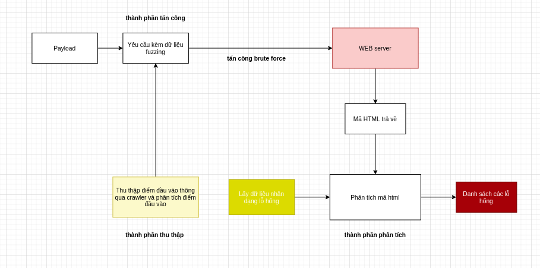

# ỨNG DỤNG FUZZING TRONG KIỂM THỬ WEB
## _được thực hiện bởi LittleHawk03 nhóm 4_

[](https://nodesource.com/products/nsolid)

[](https://travis-ci.org/joemccann/dillinger)

Dillinger is a cloud-enabled, mobile-ready, offline-storage compatible,
AngularJS-powered HTML5 Markdown editor.

- Type some Markdown on the left
- See HTML in the right
- ✨Magic ✨

## Features

- kiểm thử lỗi sql injection thông qua phương pháp error base
- kiểm thử lỗi Cross-site Scripting (XSS) 
- kiển thử lỗi File Inclusion
- Crawler url từ một web site theo cấp độ 


## Tech requirement

những yêu cầu cấu hình :

- [Python] - yêu cầu từ phiên bản python 3.x
- [Pip] - yêu cầu trình quản lý gói pip
- [git] - có thể có hoặc không để clone dư án về

## Installation

requires [python](https://www.python.org/downloads/) v10+ to run.

clone data from github : 

```sh
git clone https://github.com/LittleHawk03/Fuzzing_Project.git
```

Install the dependencies and devDependencies and start to run.

```sh
pip install -r requirement.txt
```

## How to runs

Để chạy tool scan vào thư mục project chứa file fuzzing.py chạy lệnh sau.

```sh
python fuzzing.py [-h] [-u TARGET] [-c] [-s] [-x] [-f] [-a] [-ps] [-px]
```

| Plag | option | funtion |
| ------ | ---- | ----------- |
|-h| --help |show this help message and exit|
| -u | --url  |  target url for scanning |
|-c | --crawler |the option for auto crawler from a url|
|-s| --sql     |auto detect a sql injection from a url|
|-x| --xss|   auto detect a sxx vulnerable from a url|
|-f| --file|  auto detect a file inclusion from a url|
|-a| --auto|  auto crawler and scanner all url after crawler url form a website|
|-ps| --payloadsqli|    show all payload of sql injection|
|-px| --payloadxss|     show all payload of xss vulnerable|
  
## Chức năng 1 : Cào (Crawler) URL từ một website mục tiêu.
lệnh chạy chứ năng crawler:

```sh
python fuzzing.py -u [TARGET URL] -c
```

example :

```sh
python fuzzing.py -u http://testphp.vulnweb.com/categories.php -c
```


Logic và sound code [crawler](https://github.com/LittleHawk03/Fuzzing_Project/blob/main/WebConfig/crawler.py): 


## Chức năng 2 : Dò quét lỗ hổng SQL INJECTION.

lệnh chạy chứ năng san sql ịnection:

```sh
python fuzzing.py -u [TARGET URL] -s 
```

```sh
python fuzzing.py -u [TARGET URL] --sql 
```

example :

```sh
python fuzzing.py -u http://testphp.vulnweb.com/categories.php -s
```
```sh
python fuzzing.py -u http://testphp.vulnweb.com/categories.php -sql
```

Logic và sound code [sql ịnection](https://github.com/LittleHawk03/Fuzzing_Project/tree/main/SQLi):



## Chức năng 3 : Dò quét lỗ hổng Cross-Site Scripting (XSS).

lệnh chạy chứ năng scan Cross-Site Scriptingn:

```sh
python fuzzing.py -u [TARGET URL] -x 
```

```sh
python fuzzing.py -u [TARGET URL] --xss
```

example :

```sh
python fuzzing.py -u http://testphp.vulnweb.com/categories.php -x
```
```sh
python fuzzing.py -u http://testphp.vulnweb.com/categories.php --xss
```

Logic và sound code [xss](https://github.com/LittleHawk03/Fuzzing_Project/tree/main/XSS):


## Chức năng 4 : Dò quét lỗ hổng File Inclusion.

lệnh chạy chứ năng scan File Inclusionn:

```sh
python fuzzing.py -u [TARGET URL] -f 
```

```sh
python fuzzing.py -u [TARGET URL] --file
```

example :

```sh
python fuzzing.py -u http://testphp.vulnweb.com/categories.php -f
```
```sh
python fuzzing.py -u http://testphp.vulnweb.com/categories.php --file
```

Logic và sound code [file inclusion](https://github.com/LittleHawk03/Fuzzing_Project/tree/main/FileInclusion):


   [dill]: <https://github.com/joemccann/dillinger>
   [git-repo-url]: <https://github.com/joemccann/dillinger.git>
   [john gruber]: <http://daringfireball.net>
   [df1]: <http://daringfireball.net/projects/markdown/>
   [markdown-it]: <https://github.com/markdown-it/markdown-it>
   [Ace Editor]: <http://ace.ajax.org>
   [node.js]: <http://nodejs.org>
   [Twitter Bootstrap]: <http://twitter.github.com/bootstrap/>
   [jQuery]: <http://jquery.com>
   [@tjholowaychuk]: <http://twitter.com/tjholowaychuk>
   [express]: <http://expressjs.com>
   [AngularJS]: <http://angularjs.org>
   [Gulp]: <http://gulpjs.com>

   [PlDb]: <https://github.com/joemccann/dillinger/tree/master/plugins/dropbox/README.md>
   [PlGh]: <https://github.com/joemccann/dillinger/tree/master/plugins/github/README.md>
   [PlGd]: <https://github.com/joemccann/dillinger/tree/master/plugins/googledrive/README.md>
   [PlOd]: <https://github.com/joemccann/dillinger/tree/master/plugins/onedrive/README.md>
   [PlMe]: <https://github.com/joemccann/dillinger/tree/master/plugins/medium/README.md>
   [PlGa]: <https://github.com/RahulHP/dillinger/blob/master/plugins/googleanalytics/README.md>
